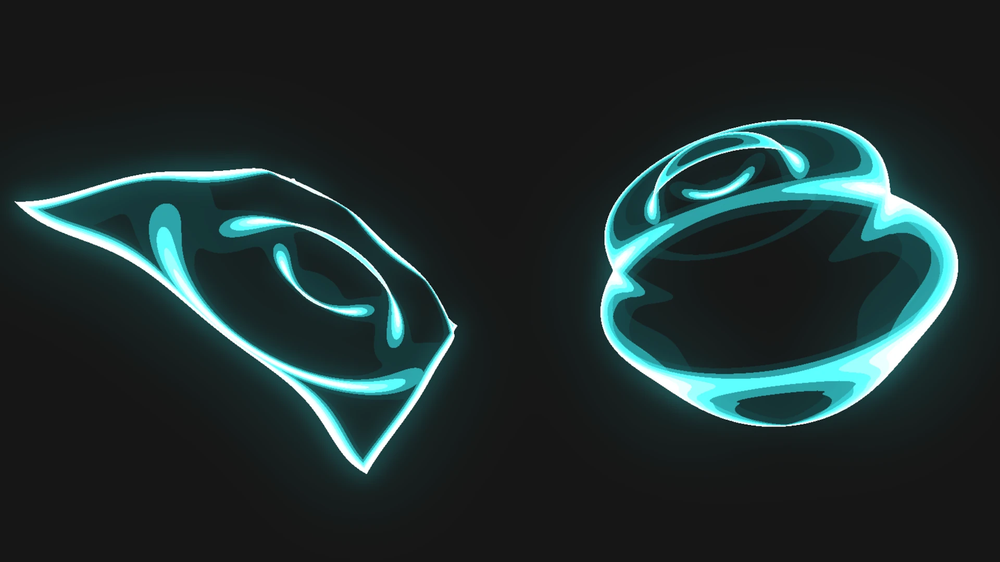

# Energy Shield
This addon for Godot provides an energy shield that can be easily integrated into your scenes. You can use either the `shield_plane.tscn` or `shield_sphere.tscn` directly, or apply the shader to other materials. Note that some adjustments may be needed to ensure proper functionality on meshes other than planes and spheres.

## Changes
- 1.0.1: Web build compatibility

## Roadmap
- [x] Release 1.0
- [x] create Youtube explaining the Shader https://youtu.be/0YiZSrtxtcg
- [ ] Dynamic number of Impacts
- [ ] Asset for Unity
- [ ] Support more types of meshes (e.g. Cube)
- [ ] Add refraction effect
- [ ] Add chromatic aberration effect

 

## Interactable
You can use the `shield.gd` script to add mouse click interactions or modify it to suit your specific needs. The following interactions are available:

**Impact**:
Impacts can be dynamically added, with up to five active at a time, by adjusting the shader’s uniform variables. Each impact generates a wave that propagates across the shield from a specified position. The wave’s intensity and speed can be customized to your preference.

**Generate/Collapse**:
The energy shield can be animated to collapse or regenerate from specified positions. Both the animation and the highlight effects are fully adjustable.

**Intersection Highlight**:
Leveraging the depth texture, the material detects and highlights nearby objects or intersections with other objects.

## Customizations

You can customize parameters such as color, wave height, frequency, and color quantization to match your game’s style. All shader parameters are thoroughly documented — refer to the example scene for demonstrations.

## Support me

Follow me on [Twitch](https://www.twitch.tv/nojoule) for some live-coding or check out my [Youtube](https://www.youtube.com/@nojoule) for content around game dev.
