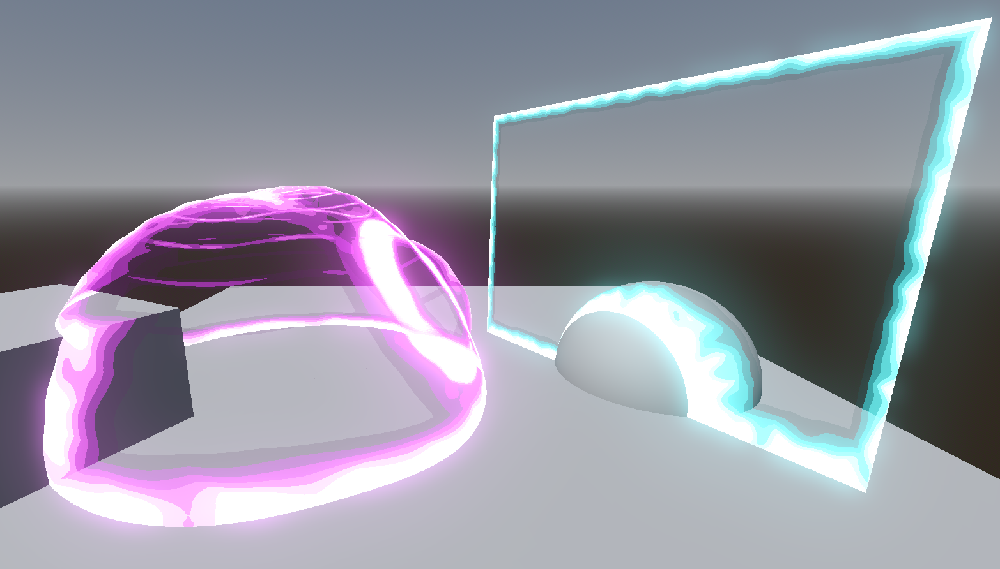

# Energy Shield
This addon adds an energy shield to Godot you can add it to your scenes. You can either use the `shield_plane.tscn` or `shield_sphere.tscn` or add the shader in other materials, although you might have to tweak it slightly to work properly on other meshes than plane and spheres.

## Updates
- [ ] Release 1.0
- [ ] create Youtube Tutorial
- [ ] Port asset for Unity
- [ ] Add refraction
- [ ] Add chromatic aberration

## Interactable
You can use the `shield.gd` script adding reaction on mouse clicks, or adjust it to your use-cases. Following interactions are available:

**Impact**:
Impacts can be dynamically added with up to 5 at a time via modifying shader uniform variables. An impact causes a wave, traveling through the object over time causing a wave originating from a specified position. The intensity and how fast it travels through the object can be adjusted.

**Generate/Collapse**:
The energy shield can collapse or regenerated from specified positions. The animation and highlight effect can be freely adjusted.

**Intersection Highlight**:
Using the depth texture, the material checks for close objects and highlighting close objects and intersections with other objects.

## Appearance

Color, wave height/frequency, quantization of the colors are just some of the customizations possible to fit the style of your game. All shader parameters are documented, check the example scene for some of them.

## Support me

Follow me on [twitch](https://www.twitch.tv/nojoule) for some live-coding or check out my [youtube](https://www.youtube.com/@nojoule) for content around game dev.
